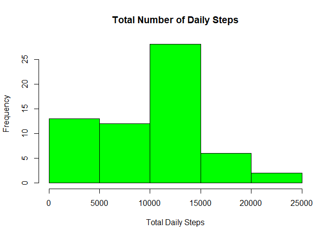
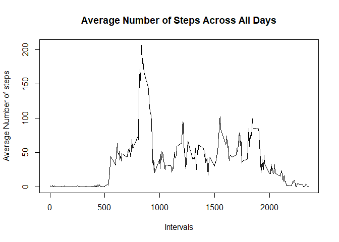
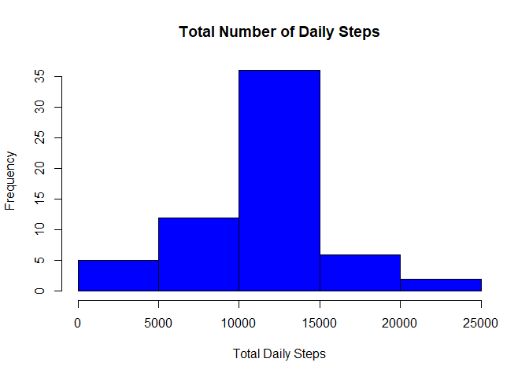
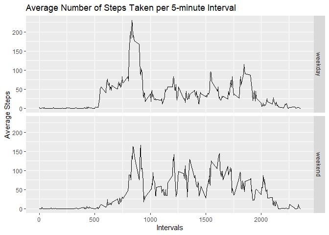

# Reproducible Research Course
# Peer-graded Assignment: Course Project 1
==================================================================================================================================
   Loading dplyrand ggplot2 librairies

```r
library("dplyr")
library("ggplot2")
```
1- Reading the data from the csv file provided

```r
activity_data <- read.csv("activity.csv")
```

Format the date column

```r
activity_data$date <- as.Date(as.character(activity_data$date,"%Y%m%d"))
```

2- Process the data to generate the total number of steps taken each day, ignoring NAs and plotting an Histogram

```r
daily_steps <- activity_data %>% group_by(date) %>% summarize(daily_steps = sum(steps, na.rm = TRUE))
hist(daily_steps$daily_steps, col = "green",main = "Total Number of Daily Steps",xlab ="Total Daily Steps")
```

<!-- -->

3- Mean and median of daily steps, ignoring NAs

```r
mean1 <- mean(daily_steps$daily_steps,na.rm = TRUE)
median1 <- median(daily_steps$daily_steps,na.rm = TRUE)
sum_steps1 <- sum(daily_steps$daily_steps, na.rm = TRUE)
print(c(mean1,median1))
```

```
## [1]  9354.23 10395.00
```

4- Process the data to generate average steps per interval and plot the data

```r
avg_steps_int <- activity_data %>% group_by(interval) %>% summarize(avg_steps = mean(steps,na.rm = TRUE))
plot(avg_steps_int$interval,avg_steps_int$avg_steps, type = "l",main = "Average Number of Steps Across All Days", xlab ="Intervals", ylab = "Average Number of steps")
```

<!-- -->

5- The 5-minute interval that, on average, contains the maximum number of steps

```r
max_avg <- avg_steps_int[which.max(avg_steps_int$avg_steps),]
print(max_avg[[1]])
```

```
## [1] 835
```

6- Imputing missing data by replacing missing data with averge for the same interval across all days
 
   First the number of NAs in activity_data

```r
sum(is.na(activity_data$steps))
```

```
## [1] 2304
```

   Then merge activity_steps with avg_steps_int 

```r
activity_data_avg <- merge(activity_data,avg_steps_int, by.x = "interval")
```

   Finally, we replace NAs values with avg

```r
activity_data_avg <- activity_data_avg %>% mutate(steps = ifelse(is.na(steps),avg_steps,steps))
```

7- Process the cleaned data to generate the total number of steps taken each day and plotting an Histogram

```r
daily_steps <- activity_data_avg %>% group_by(date) %>% summarize(daily_steps = sum(steps))
hist(daily_steps$daily_steps, col = "blue",main = "Total Number of Daily Steps",xlab ="Total Daily Steps")
```

<!-- -->

  Mean and median of daily steps after NAs were replaced

```r
mean2 <- mean(daily_steps$daily_steps)
median2 <- median(daily_steps$daily_steps)
sum_steps2 <- sum(daily_steps$daily_steps)
print(c(mean2,median2))
```

```
## [1] 10766.19 10766.19
```

  Difference between mean ignoring NAs and mean with NAs replacement
 
 ```r
 print(mean1 - mean2)
 ```
 
 ```
 ## [1] -1411.959
 ```
  Difference between median ignoring NAs and median with NAs replacement
 
 ```r
 print(median1 - median2)
 ```
 
 ```
 ## [1] -371.1887
 ```
  Impact of imputing missing data on the estimates of the total daily number of steps
  

```r
print(sum_steps2 - sum_steps1)
```

```
## [1] 86129.51
```
  
8- Panel plot comparing the average number of steps taken per 5-minute interval across weekdays and weekends
   First, adding one more variable to activity_data_avg to differenciate between weekday and weekend
   

```r
activity_data_avg <- activity_data_avg %>% mutate(Week_Day = ifelse(weekdays(date) %in% c("Saturday","Sunday"),"weekend","weekday"))
```

  Then, summarize the data to generate the panel 
  

```r
daily_steps2 <- activity_data_avg %>% group_by(interval,Week_Day) %>% summarize(avg_steps = mean(steps))
qplot(interval,avg_steps, data = daily_steps2, facets = Week_Day ~ ., geom = "line", main ="Average Number of Steps Taken per 5-minute Interval", ylab = "Average Steps",xlab = "Intervals")
```

<!-- -->

